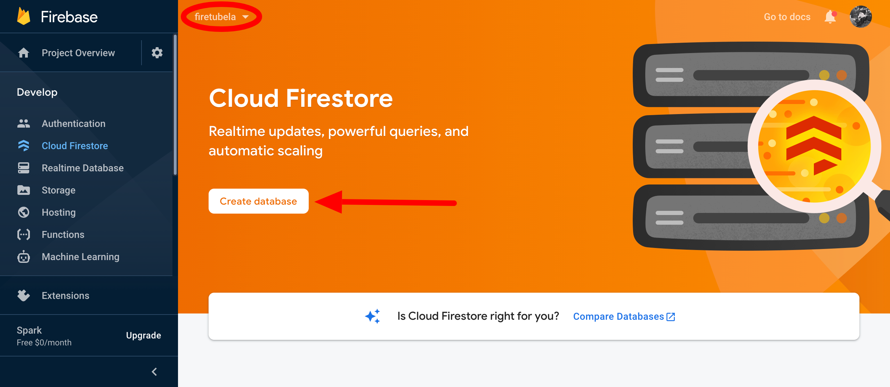
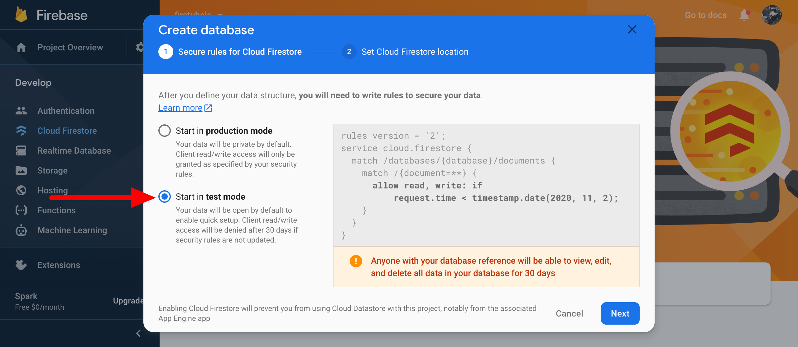
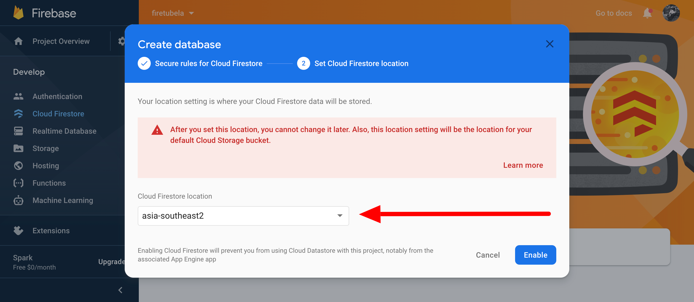
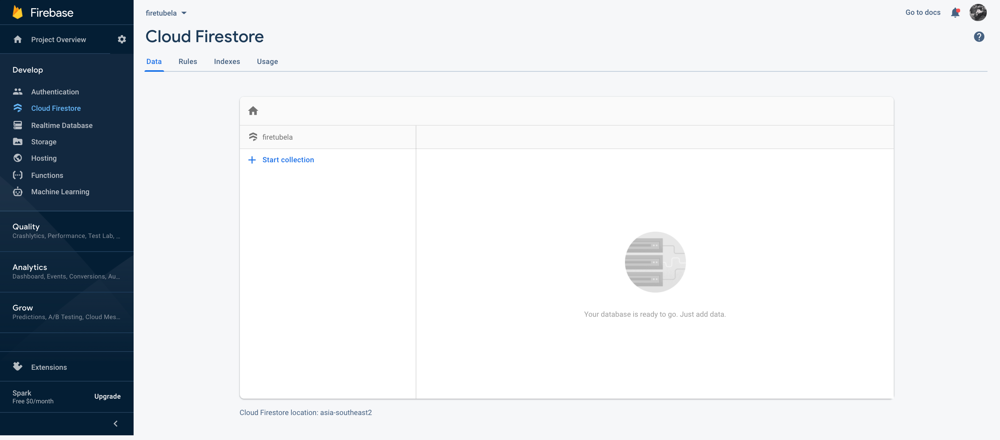
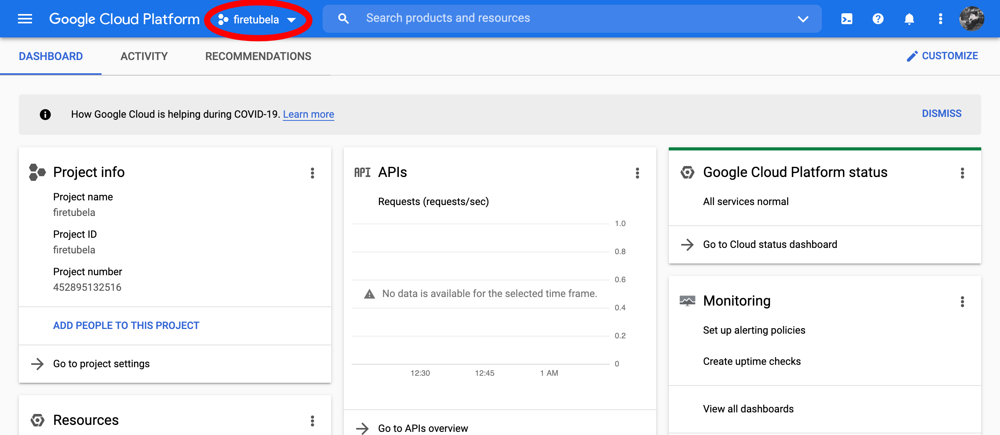
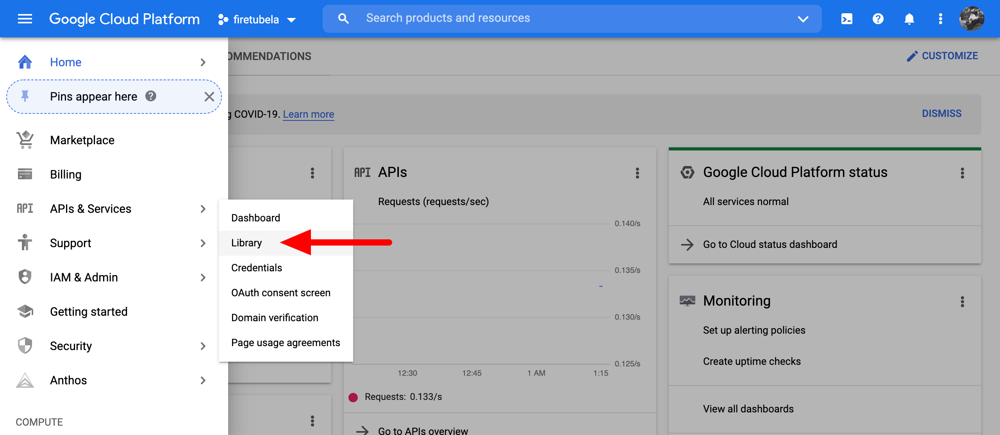
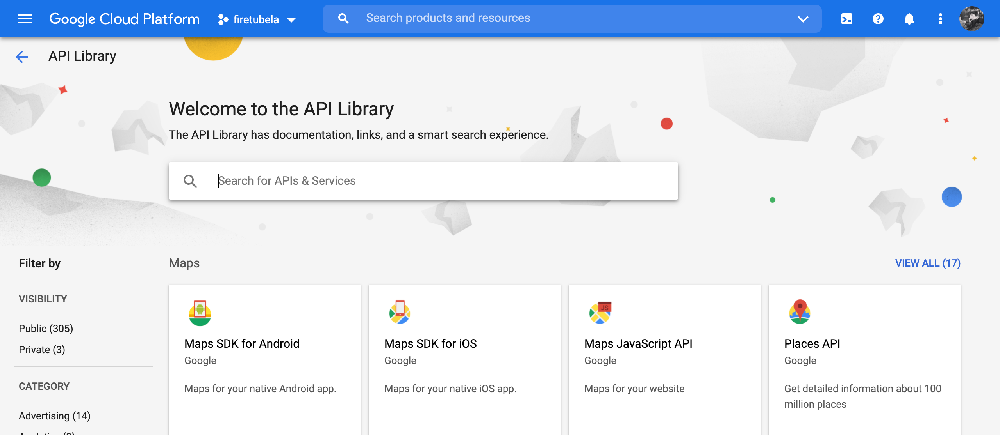
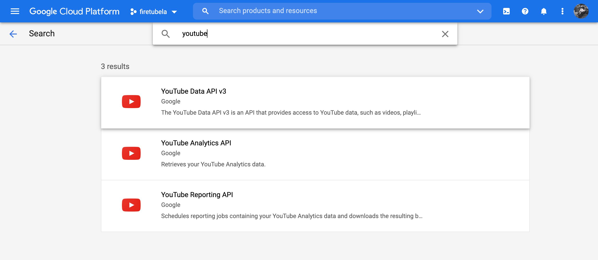

# Initial Firebase

This Firebase project will later be used to host the Vue project, provide user authentication with Google and save user credentials so that later we can use it to interact with Youtube API.

## Prerequisite

- A Google account to use [Firebase](https://firebase.google.com/), [Google Cloud Platform](https://cloud.google.com/) and [YouTube](https://www.youtube.com/).
- Install [Firebase CLI](https://firebase.google.com/docs/cli) and sign in to Firebase on your local machine using Firebase CLI
- If you want to deploy something to Firebase, you need to upgrade your account to a paid tier. A free Google account is all you need to play with Firebase things in your development environment.

You can follow my instruction to play with a new Firebase and Google Cloud Platform project or integrate with your existed project with a little tweak (which you can easily figure out after reading my instruction).

## First time initial firebase

Open your favorite console and input as below

```bash
mkdir firetubela
cd firetubela
firebase init
```

Follow step by step Firebase CLI instruction to create a new Firebase project

```text

     ######## #### ########  ######## ########     ###     ######  ########
     ##        ##  ##     ## ##       ##     ##  ##   ##  ##       ##
     ######    ##  ########  ######   ########  #########  ######  ######
     ##        ##  ##    ##  ##       ##     ## ##     ##       ## ##
     ##       #### ##     ## ######## ########  ##     ##  ######  ########

You're about to initialize a Firebase project in this directory:

  <your-path-to-firetubela-folder>

? Which Firebase CLI features do you want to set up for this folder? Press Space to select features, then Enter to confirm
your choices. Firestore: Deploy rules and create indexes for Firestore, Functions: Configure and deploy Cloud Functions, Ho
sting: Configure and deploy Firebase Hosting sites, Emulators: Set up local emulators for Firebase features

=== Project Setup

First, let's associate this project directory with a Firebase project.
You can create multiple project aliases by running firebase use --add,
but for now we'll just set up a default project.

? Please select an option: Create a new project
i  If you want to create a project in a Google Cloud organization or folder, please use "firebase projects:create" instead, and return to this command when you've created the project.
? Please specify a unique project id (warning: cannot be modified afterward) [6-30 characters]:
firetubela
? What would you like to call your project? (defaults to your project ID)
✔ Creating Google Cloud Platform project
✔ Adding Firebase resources to Google Cloud Platform project

🎉🎉🎉 Your Firebase project is ready! 🎉🎉🎉

Project information:
  - Project ID: firetubela
  - Project Name: firetubela

Firebase console is available at
https://console.firebase.google.com/project/firetubela/overview
i  Using project firetubela (firetubela)

=== Firestore Setup

Error: It looks like you haven't used Cloud Firestore in this project before. Go to https://console.firebase.google.com/project/firetubela/firestore to create your Cloud Firestore database.
```

Now you have a Google Cloud Platform project named firetubela and a Firebase project named firetubela which are all automatically created by Firebase CLI but your local Firebase project folder is not successfully created due to a  Firestore error. Keep your console open so we can continue later.

## Create Firebase Database

Go to your firetubela Firebase project to create a new Firestore database







After finishing create a new Firestore database, you will see a blank database like this



Now come back to finish initial firetubela Firebase project.

## Finish initial Firebase project

Back to the previous opened console

```bash
firebase init
```

Redo some of previous steps

```text

     ######## #### ########  ######## ########     ###     ######  ########
     ##        ##  ##     ## ##       ##     ##  ##   ##  ##       ##
     ######    ##  ########  ######   ########  #########  ######  ######
     ##        ##  ##    ##  ##       ##     ## ##     ##       ## ##
     ##       #### ##     ## ######## ########  ##     ##  ######  ########

You're about to initialize a Firebase project in this directory:

  <your-path-to-firetubela-folder>

? Which Firebase CLI features do you want to set up for this folder?
Press Space to select features, then Enter to confirm your choices.
Firestore: Deploy rules and create indexes for Firestore,
Functions: Configure and deploy Cloud Functions,
Hosting: Configure and deploy Firebase Hosting sites,
Emulators: Set up local emulators for Firebase features

=== Project Setup

First, let's associate this project directory with a Firebase project.
You can create multiple project aliases by running firebase use --add,
but for now we'll just set up a default project.

? Please select an option: Create a new project
i  If you want to create a project in a Google Cloud organization or folder,
please use "firebase projects:create" instead,
and return to this command when you've created the project.
? Please specify a unique project id
(warning: cannot be modified afterward) [6-30 characters]:
firetubela
? What would you like to call your project? (defaults to your project ID)
✔ Creating Google Cloud Platform project
✔ Adding Firebase resources to Google Cloud Platform project

🎉🎉🎉 Your Firebase project is ready! 🎉🎉🎉

Project information:
  - Project ID: firetubela
  - Project Name: firetubela

Firebase console is available at
https://console.firebase.google.com/project/firetubela/overview
i  Using project firetubela (firetubela)

=== Firestore Setup

Firestore Security Rules allow you to define how and when to allow
requests. You can keeps these rules in your project directory
and publish them with firebase deploy.

? What file should be used for Firestore Rules? firestore.rules

Firestore indexes allow you to perform complex queries while
maintaining performance that scales with the size of the result
set. You can keep index definitions in your project directory
and publish them with firebase deploy.

? What file should be used for Firestore indexes? firestore.indexes.json

=== Functions Setup

A functions directory will be created in your project with a Node.js
package pre-configured. Functions can be deployed with firebase deploy.

? What language would you like to use to write Cloud Functions? Javascript
? Do you want to use Eslint to catch probable bugs and enforce styles? Yes
✔  Wrote functions/package.json
✔  Wrote functions/.eslintrc.json
✔  Wrote functions/index.js
✔  Wrote functions/.gitignore
? Do you want to install dependencies with npm now? Yes

=== Hosting Setup

Your public directory is the folder (relative to your project directory) that
will contain Hosting assets to be uploaded with firebase deploy. If you
have a build process for your assets, use your build's output directory.

? What do you want to use as your public directory? dist
? Configure as a single-page app (rewrite all urls to /index.html)? Yes
✔  Wrote public/index.html

=== Emulators Setup
? Which Firebase emulators you want to set up? Press Space to select emulators,
then Enter to confirm your choice.
Functions Emulator, Firestore Emulator, Hosting Emulator
? Which port do you want to use for the functions emulator? 5001
? Which port do you want to use for the firestore emulator? 8080
? Which port do you want to use for the hosting emulator? 5000
? Would you like to enable the Emulator UI? Yes
? Which port do you want to use for the Emulator UI
(leave empty to use any available port)? NaN
? Would you like to download the emulators now? Yes
i  firestore: downloading cloud-firestore-emulator-v1.11.7.jar...
Progress: =====================================================> (100% of 64MB)

i  Writing configuration info to firebase.json...
i  Writing project information to .firebaserc...
i  Writing gitignore file to .gitignore...

✔  Firebase initialization complete!
```

Now you have a successfully created Firebase project folder with:

- A Node.js **functions** folder which is used as a backend to generate necessary tokens after user signed in using Google account.
- A hosting server for the Vue project which later be used as the place for user to choose the sign in method to give us the necessary permission to interact with Youtube.
- A Firestore database to save the generated tokens.
- 3 Emulators for those 3 above Firebase's services so that we can play with them in our local machine without the need of deploying them to the real Firebase servers.

## Add Youtube API to Google Cloud Platform project

Go to Google Cloud Platform firetubela project page and do as shown below









Now your Firebase project and Google Cloud Platform firetubela project are both ready to use in the next steps.
